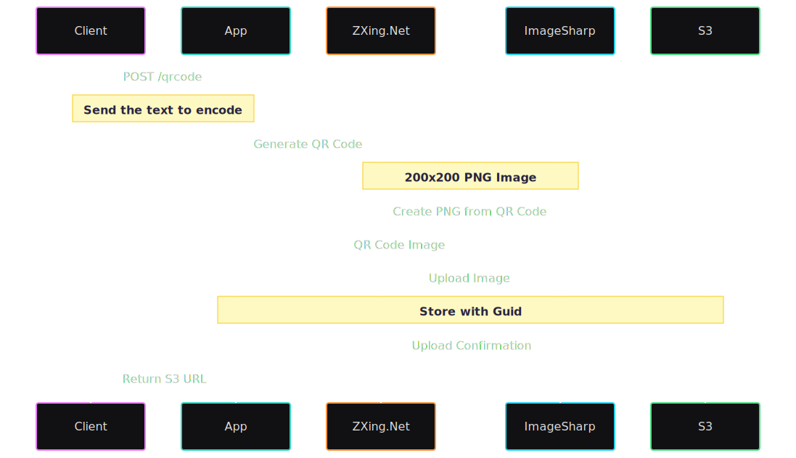
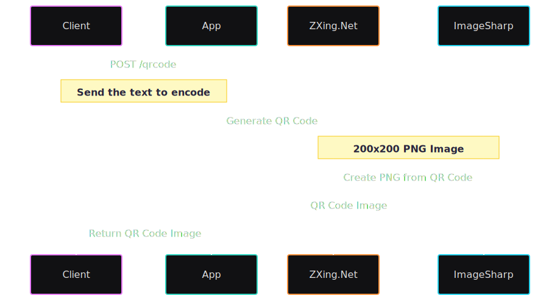

# QrCodeGenerator


A .NET application that generates QR codes and stores them in AWS S3. This project demonstrates the integration of Google's ZXing Port library for QR code generation and AWS S3 for storage.

## Table of Contents

- [How to Use](#how-to-use)
    - [Prerequisites](#prerequisites)
    - [Environment Variables](#environment-variables)
    - [Running the Application](#running-the-application)
        - [Local Development](#local-development)
        - [Docker Deployment](#docker-deployment)
    - [AWS S3 Configuration](#aws-s3-configuration)
- [API Endpoints](#api-endpoints)
- [License](#license)

## How to Use

This section provides comprehensive instructions for setting up and running the QR Code Generator application.

### Prerequisites

- .NET 9 SDK
- Docker
- AWS Account with S3 access
- AWS CLI configured with appropriate credentials

### Environment Variables

Create a `.env` file in the project root with the following variables:

```env
AWS_ACCESS_KEY_ID=your_access_key
AWS_SECRET_ACCESS_KEY=your_secret_key
AWS_REGION=your_region
AWS_BUCKET_NAME=your_bucket_name
```

### Running the Application

#### Local Development

1. Build the project:
   ```bash
   dotnet build
   ```
2. Run the application:
   1. On Windows, use powershell
      ```bash
      $env:AWS_ACCESS_KEY_ID="your_access_key";$env:AWS_SECRET_ACCESS_KEY="your_secret_key";$env:AWS_REGION="your_region";$env:S3Options__Region="your_region";$env:S3Options__BucketName="your_bucket_name";dotnet run --project .\QrCodeGenerator\QrCodeGenerator.csproj 
      ```
   2. On Linux, use bash
      ```bash
      AWS_ACCESS_KEY_ID="your_access_key" AWS_SECRET_ACCESS_KEY="your_secret_key" AWS_REGION="your_region" S3Options__Region="your_region" S3Options__BucketName="your_bucket_name" dotnet run --project .\QrCodeGenerator\QrCodeGenerator.csproj 
      ```

#### Docker

1. Create the `.env` file as described above
> Remember to replace the .env file path to the path of your environment file that you created into compose.yaml.
2. Run the application from compose file:
   ```bash
   docker compose up 
   ```

### AWS S3 Configuration

1. Create an S3 bucket in your AWS account
2. Update the `AWS_BUCKET_NAME` in your `.env` file or run command
3. Ensure your AWS credentials have appropriate permissions to access the S3 bucket

## API Endpoints

### POST /qrcode
Generates a QR code from the provided text and store it in AWS S3. The QR code will be generated as a PNG image with dimensions of 200x200 pixels.

**Parameters**

| Name | Required | Type | Description |
|------|----------|------|-------------|
| `text` | required | string | The text content to be encoded in the QR code. This can be any string value that you want to convert into a QR code. |

**Response**

```json
{
    "url": "https://your-bucket.s3.your-region.amazonaws.com/guid"
}
```

**Error Response**

If an error occurs during QR code generation or S3 upload, the API will return a 500 Internal Server Error.

**Example Usage**

```bash
curl -X POST http://localhost:8080/qrcode \
     -H "Content-Type: application/json" \
     -d '{"text": "https://example.com"}'
```

**Application Flow**



### POST /qrcode/local
Generates a QR code from the provided text, without saving to S3. The QR code will be generated as a PNG image with dimensions of 200x200 pixels.

**Parameters**

| Name | Required | Type | Description |
|------|----------|------|-------------|
| `text` | required | string | The text content to be encoded in the QR code. This can be any string value that you want to convert into a QR code. |

**Response**

```http
Content-Type: image/png
```

**Error Response**

If an error occurs during QR code generation, the API will return a 500 Internal Server Error.

**Example Usage**

```bash
curl -X POST http://localhost:8080/qrcode/local \
     -H "Content-Type: application/json" \
     -d '{"text": "https://example.com"}'
```

**Application Flow**

